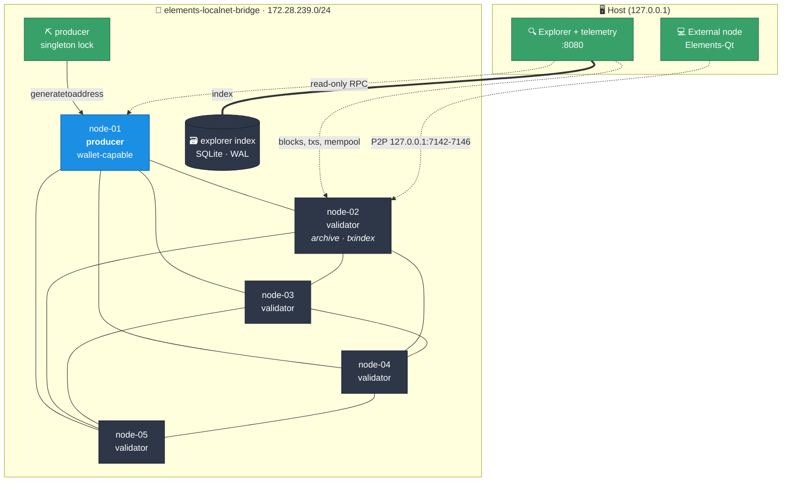

<div align="center">

# ⛓️ elements-localnet

**A private, reproducible Elements blockchain on your laptop — five nodes, a block producer, and a real block explorer, in one command.**

[](https://github.com/ElementsProject/elements)
[](https://docs.docker.com/compose/)
[](#requirements)
[](LICENSE)

</div>

---

`elements-localnet` spins up a self-contained [Elements](https://elementsproject.org/)
network you fully control: your own genesis block, your own block reward, your own
halving schedule, and blocks that arrive exactly when you say so. No testnet faucets,
no waiting, no public peers.

It is built for developing and testing against Elements — issuing assets, exercising
confidential transactions, driving RPC clients — where a public chain is too slow,
too shared, or too unpredictable.

> [!NOTE]
> This is an `OP_TRUE`-signed development chain. The coins are worthless by design.
> Never point these configs at Liquid or expose them to an untrusted network.

## Highlights

| | |
|---|---|
| 🧬 **Your own chain** | Custom genesis, block subsidy, and halving interval — set at creation, enforced by consensus |
| ⛏️ **Deterministic blocks** | A producer mines on a fixed interval, or mine manually with `./manage.sh mine N` |
| 🕸️ **Full-mesh P2P** | Every node peers with every other node; no single point of failure |
| 🔍 **Real block explorer** | Blocks, transactions, addresses, assets, mempool and search, backed by a resumable SQLite index |
| 📊 **Live telemetry** | Height, consensus, peers, mempool, node health and producer state on the same origin |
| 🙈 **Honest about blinding** | Confidential amounts are shown as `Confidential`, never estimated or inferred |
| 🔌 **External nodes welcome** | Each node publishes a P2P port (loopback by default) so Elements-Qt or a remote node can join |
| 🔐 **Secrets stay local** | Per-node `rpcauth` hashes, scoped monitor identities, nothing sensitive in Git |
| 📦 **Pinned & verified** | Elements release checked against a SHA-256 digest at image build |
| 🧹 **Zero runtime deps** | Bash, Docker, OpenSSL. No Python, no Node, no package manager |

## Architecture



**`node-01`** is the only block-producing node. It is wallet-capable for deliberate
reward operations but normally runs with no wallet loaded.
**`node-02`** is an unpruned archive validator with `txindex`, ready for an explorer.
**`node-03`–`node-05`** are unpruned validators with wallet RPC disabled.
**`producer`** holds a shared singleton lock, reads one *public* payout address and an
RPC credential, and calls `generatetoaddress` on node-01. It never sees a key.
**`explorer`** does two jobs behind one origin. It polls every node concurrently with
2-second deadlines for live telemetry, and it runs a resumable incremental indexer
against `node-02` that writes blocks, transactions, inputs, outputs, issuances,
assets and address history into a SQLite database in its own named volume. It has no
wallet, no wallet RPC, no control API, and no Docker socket. See
[docs/EXPLORER_ARCHITECTURE.md](docs/EXPLORER_ARCHITECTURE.md) and
[docs/EXPLORER_SCHEMA.md](docs/EXPLORER_SCHEMA.md).

## Quick start

```bash
git clone https://github.com/Lord1Egypt/elements-localnet.git
cd elements-localnet
./setup-network.sh
```

Then open **<http://127.0.0.1:8080>**.

Run on a terminal with no arguments, `setup-network.sh` walks through the network
name, node count, block interval, subsidy, halving interval, automatic production,
topology, external peer access, P2P exposure, host ports, and payout choice, then
prints a summary and asks for confirmation before it changes anything.

<details>
<summary><b>Non-interactive setup</b></summary>

Passing any flag selects non-interactive mode, and a non-terminal stdin does too, so
CI never blocks on a prompt. `./setup-network.sh --help` documents every option.

```bash
./setup-network.sh \
  --network-name elements-localnet \
  --nodes 5 \
  --topology mesh \
  --block-reward-sats 5000000000 \
  --halving-interval 210000 \
  --block-interval 60 \
  --auto-mine yes \
  --external-peers yes \
  --p2p-exposure localhost \
  --p2p-port-base 7142 \
  --rpc-port-base 7041 \
  --dashboard-port 8080 \
  --new-payout-wallet \
  --non-interactive --yes
```

</details>

### Defaults

| Setting | Default | Notes |
|---|---:|---|
| Nodes | `5` | Above 20 needs `--allow-large-network`; above 200 always refused |
| Block reward | `5000000000` sats | 50 units, Bitcoin-style |
| Halving interval | `210000` blocks | |
| Block interval | `60` s | Change anytime with `./manage.sh producer interval N` |
| RPC ports | `7041`+ | Bound to `127.0.0.1` only |
| P2P ports | `7142`+ | Bound to `127.0.0.1` only; `--p2p-exposure lan` opts in to all interfaces |
| P2P exposure | `localhost` | `localhost`, `lan`, or `disabled` |
| Topology | `mesh` | `mesh` or `seed` |
| Explorer | `8080` | Bound to `127.0.0.1` only |

Credentials are written under the git-ignored `generated/secrets/` directory and are
never printed to the terminal.

> [!WARNING]
> A 1-second interval is local-development only: it mints 86,400 blocks and
> 4,320,000 subsidy units per day, reaching the first halving in about 58 hours
> instead of four years. Coinbase maturity shrinks to roughly 100 seconds.

## Connecting an external node

Every node publishes its P2P listener on the host, so a desktop wallet or a node on
another machine can join the network as a real peer. By default those ports bind to
`127.0.0.1` only. Choose `--p2p-exposure lan` deliberately if a peer on another
machine needs them, or `disabled` to publish no P2P port at all.

| Host port | Node | | Host port | Node |
|---:|---|---|---:|---|
| `7142` | node-01 (producer) | | `7145` | node-04 |
| `7143` | node-02 (archive) | | `7146` | node-05 |
| `7144` | node-03 | | | |

The consensus parameters below **must match byte for byte**, or your node computes a
different genesis block and will never peer:

```ini
chain=elements

[elements]
validatepegin=0
initialfreecoins=0
anyonecanspendaremine=0
con_blocksubsidy=5000000000
con_nsubsidyhalvinginterval=210000
signblockscript=51
evbparams=dynafed:0:::

addnode=127.0.0.1:7142
addnode=127.0.0.1:7143
addnode=127.0.0.1:7144
addnode=127.0.0.1:7145
addnode=127.0.0.1:7146

server=1
listen=1
txindex=1
blindedaddresses=0
port=18887
rpcport=18885
```

Adjust `con_blocksubsidy` and `con_nsubsidyhalvinginterval` if you changed them at
setup. On Windows this file goes in `%APPDATA%\Elements\elements.conf`.

With the default loopback exposure and the nodes running under WSL2, Windows
`127.0.0.1:7142`–`7146` reaches them through WSL's localhost forwarding; this was
verified with Elements-Qt connecting to all five nodes. If your host cannot forward
localhost into WSL, use the WSL IP from `wsl hostname -I` in the `addnode` lines
rather than switching the published bind address to every interface. Only fall back
to `--p2p-exposure lan` when a peer on a *different machine* must connect.

## Management

```bash
./manage.sh status                  # health, height, and consensus across all nodes
./manage.sh peers                   # peer counts and connection directions
./manage.sh height                  # current tip
./manage.sh mine 101                # manual mining (refused while the producer runs)
./manage.sh logs node-02            # follow one node
./manage.sh producer start|stop|status
./manage.sh producer interval 60    # retune cadence without restarting nodes
./manage.sh explorer status         # container state plus indexer height, lag, schema
./manage.sh explorer logs
./manage.sh explorer restart
./manage.sh explorer backup         # consistent SQLite copy into generated/backups/
./manage.sh explorer reindex --yes-i-understand
./manage.sh wallet load|unload|status
./manage.sh start|stop|restart      # volumes and chain state always preserved
./manage.sh verify [--acceptance]
```

`producer interval` persists the value, regenerates only Compose and the explorer
inventory, and recreates only the producer and explorer containers — nodes and
blockchain volumes are untouched.

`explorer reindex` prints the exact Docker volume it will delete, then deletes only
that rebuildable index and rebuilds it from genesis. Elements node volumes, chain
data, wallets, credentials and `generated/public/assets.json` are never touched.

<details>
<summary><b>Destroying a network</b></summary>

```bash
./manage.sh destroy --yes-i-understand
```

Deliberately awkward. It prints the exact generated directory and named volumes
first, and never uses a broad or unresolved removal path. There is no recovery
unless you backed the data up separately.

</details>

## Explorer, telemetry & API

Everything is served from one origin, **<http://127.0.0.1:8080>**: Overview, Blocks,
Transactions, Assets, Mempool, Nodes, plus block, transaction, address and asset
detail pages and a global search. The UI is embedded in the binary — no CDN, no
Node.js runtime, no framework needed at runtime.

Nodes are classified `HEALTHY`, `SYNCING`, `DIVERGED`, `FORKED`, `STALE`, `OFFLINE`,
or `ERROR`. Canonical selection uses the most common height/hash pair; equal-height
hashes are compared directly, because chainwork does not reliably distinguish
signed-chain forks.

```text
GET /healthz
GET /readyz
GET /api/v1/network
GET /api/v1/nodes
GET /api/v1/nodes/{id}
GET /api/v1/topology
GET /api/v1/producer
GET /api/v1/economics

GET /api/v1/explorer/status
GET /api/v1/explorer/overview
GET /api/v1/blocks?limit=&before=
GET /api/v1/blocks/{height-or-hash}?limit=&offset=
GET /api/v1/blocks/{height-or-hash}/raw
GET /api/v1/transactions?limit=
GET /api/v1/transactions/{txid}
GET /api/v1/transactions/{txid}/raw
GET /api/v1/addresses/{address}?limit=&offset=
GET /api/v1/addresses/{address}/utxos?limit=&offset=
GET /api/v1/assets?limit=&offset=
GET /api/v1/assets/{asset-id}?limit=&offset=
GET /api/v1/assets/{asset-id}/transactions?limit=&offset=
GET /api/v1/mempool?limit=&offset=
GET /api/v1/search?q=
```

Every list endpoint is paginated with a hard maximum of 100 records per request and
an offset ceiling; oversized limits are clamped and invalid ones rejected with a
structured error. Errors are sanitized codes — never an RPC URL, credential, file
path, SQL message, or Go stack trace.

There is no generic RPC proxy. Each node carries two scoped identities restricted by
Elements `rpcwhitelist`:

- **monitor** — `getblockchaininfo`, `getnetworkinfo`, `getmempoolinfo`,
  `getpeerinfo`, `getconnectioncount`, `getchaintips`, `getblockheader`,
  `getmininginfo`
- **explorer** — `getblockchaininfo`, `getsidechaininfo`, `getblockhash`, `getblock`,
  `getblockheader`, `getrawtransaction`, `getrawmempool`, `getmempoolinfo`,
  `getmempoolentry`, `getchaintips`

### Confidential data

The explorer never invents or estimates a blinded value.

| On chain | Shown as |
|---|---|
| Blinded amount | `Confidential`, with the value commitment in the advanced section |
| Blinded asset | `Confidential commitment`, with the asset commitment in the advanced section |
| Confidential issuance | `Supply: Not publicly verifiable` and `Issuance: Confidential` |
| Output script | The derived **unconfidential script address**, labelled as such |

A confidential address supplied by a sender is not recorded on chain, so an address
page never claims to show one. A supply figure reported by a wallet owner is a claim,
not proof, and is not presented as consensus data.

### Asset metadata

`generated/public/assets.json` holds operator-supplied names, tickers, descriptions,
decimals, logo paths, websites and test/official status, keyed by Asset ID. Start
from [`config/assets.example.json`](config/assets.example.json). It is descriptive
labelling only; the explorer always shows the on-chain issuance facts separately.

## Wallet behavior

Setup creates a descriptor wallet named `payout` on node-01, generates an
unconfidential payout address, writes a backup to
`generated/secrets/wallet/payout-wallet.backup`, then **unloads** it. The producer
receives only the public address — never a key, descriptor secret, mnemonic, or
wallet file. All other nodes are built with wallet RPC disabled.

> [!TIP]
> `issueasset` has no unlocked-wallet check. On an encrypted wallet it fails at the
> signing stage with a generic `Signing transaction failed (code -4)`. Run
> `walletpassphrase "your passphrase" 120` first.

Loading the payout wallet after millions of rewards is expensive. Reward-wallet
epochs, coinbase consolidation, and PSET-based spending are tracked in
[ROADMAP.md](ROADMAP.md).

## Requirements

- x86_64 / amd64
- Docker Engine and Docker Compose v2 (`docker compose`)
- Bash, OpenSSL, curl — plus `jq` for the verification scripts
- Linux, or Windows 11 with Docker Desktop + WSL2
- `shellcheck` and `ripgrep` optional, used by `tests/static-checks.sh`

Allocate enough Docker memory for five Elements nodes and their default caches.

## Security notes

- This is a private development chain, not a public-network security design.
- RPC ports, P2P ports and the explorer all bind to `127.0.0.1` by default. Public
  RPC is never published. `--p2p-exposure lan` is the only way to reach every host
  interface, and it warns before applying.
- Generated configs contain only hashed `rpcauth` values. Raw credentials and the
  payout backup are git-ignored and stored with restrictive modes.
- The explorer holds monitor and explorer credentials only, both mounted read-only.
  It never calls wallet RPC, accepts RPC method input, mounts a wallet file, or
  mounts `/var/run/docker.sock`. It runs as a non-root user with `cap_drop: ALL`,
  `no-new-privileges`, a read-only root filesystem, and one writable mount for its
  rebuildable index.
- Never run `invalidateblock` experiments against these volumes — use a disposable
  Compose project with separate volumes.
- Do not use this chain for assets with real value.

## Troubleshooting

| Symptom | Fix |
|---|---|
| Docker unavailable | Confirm `docker info` and `docker compose version` work in the same shell |
| Port conflict | Setup detects it and refuses before changing the runtime. Free `7041`–`7040+N`, `7142`–`7141+N`, and `8080` |
| Explorer shows "Indexing…" | Normal on a fresh index; the UI stays usable. `./manage.sh explorer status` shows height and lag |
| Explorer index looks wrong | `./manage.sh explorer reindex --yes-i-understand` rebuilds it from genesis |
| Windows Elements-Qt will not peer | Confirm WSL localhost forwarding, or use the `wsl hostname -I` address in `addnode` |
| Node unhealthy | `./manage.sh logs node-01` and `./manage.sh status` |
| Peers slow after a raw Compose restart | Use `./manage.sh restart`; `addnode` retries on its own timer |
| External node won't peer | Consensus params differ — compare against `generated/nodes/node-01/elements.conf` |
| Changing consensus refused | Intentional. Destroy the network explicitly, then re-run setup |

## Documentation

| | |
|---|---|
| [DECISIONS.md](DECISIONS.md) | Design rationale and rejected alternatives |
| [ROADMAP.md](ROADMAP.md) | Planned phases |
| [ACCEPTANCE_TEST_REPORT.md](ACCEPTANCE_TEST_REPORT.md) | The exact tested baseline |
| [UPSTREAM.md](UPSTREAM.md) | Pinned Elements release and verification |
| [docs/EXPLORER_ARCHITECTURE.md](docs/EXPLORER_ARCHITECTURE.md) | Explorer service, indexer, reorg handling, security posture |
| [docs/EXPLORER_SCHEMA.md](docs/EXPLORER_SCHEMA.md) | Index schema, migrations, and query patterns |
| [PROJECT_STATE.md](PROJECT_STATE.md) | Current runtime state and exact resume point |

## License

[MIT](LICENSE) — built on [Elements Core](https://github.com/ElementsProject/elements)
by the Elements Project developers.
