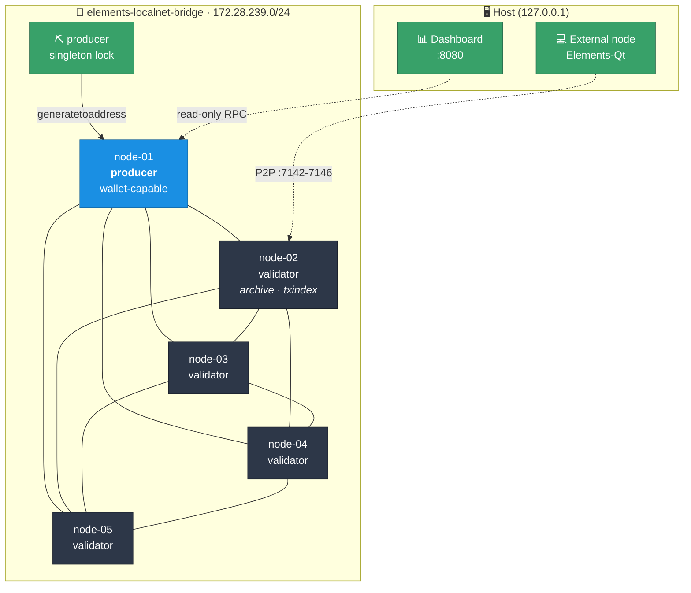

<div align="center">

# ⛓️ elements-localnet

**A private, reproducible Elements blockchain on your laptop — five nodes, a block producer, and a live dashboard, in one command.**

[](https://github.com/ElementsProject/elements)
[](https://docs.docker.com/compose/)
[](#requirements)
[](LICENSE)

</div>

---

`elements-localnet` spins up a self-contained [Elements](https://elementsproject.org/)
network you fully control: your own genesis block, your own block reward, your own
halving schedule, and blocks that arrive exactly when you say so. No testnet faucets,
no waiting, no public peers.

It is built for developing and testing against Elements — issuing assets, exercising
confidential transactions, driving RPC clients — where a public chain is too slow,
too shared, or too unpredictable.

> [!NOTE]
> This is an `OP_TRUE`-signed development chain. The coins are worthless by design.
> Never point these configs at Liquid or expose them to an untrusted network.

## Highlights

| | |
|---|---|
| 🧬 **Your own chain** | Custom genesis, block subsidy, and halving interval — set at creation, enforced by consensus |
| ⛏️ **Deterministic blocks** | A producer mines on a fixed interval, or mine manually with `./manage.sh mine N` |
| 🕸️ **Full-mesh P2P** | Every node peers with every other node; no single point of failure |
| 📊 **Live dashboard** | Read-only Go service showing height, consensus, peers, mempool, and producer state |
| 🔌 **External nodes welcome** | Each node publishes a P2P port so Elements-Qt or a remote node can join |
| 🔐 **Secrets stay local** | Per-node `rpcauth` hashes, scoped monitor identities, nothing sensitive in Git |
| 📦 **Pinned & verified** | Elements release checked against a SHA-256 digest at image build |
| 🧹 **Zero runtime deps** | Bash, Docker, OpenSSL. No Python, no Node, no package manager |

## Architecture



**`node-01`** is the only block-producing node. It is wallet-capable for deliberate
reward operations but normally runs with no wallet loaded.
**`node-02`** is an unpruned archive validator with `txindex`, ready for an explorer.
**`node-03`–`node-05`** are unpruned validators with wallet RPC disabled.
**`producer`** holds a shared singleton lock, reads one *public* payout address and an
RPC credential, and calls `generatetoaddress` on node-01. It never sees a key.
**`network-status`** polls every node concurrently with 2-second deadlines and serves
read-only HTTP. It has no wallet, no database, no control API, and no Docker socket.

## Quick start

```bash
git clone https://github.com/Lord1Egypt/elements-localnet.git
cd elements-localnet
./setup-network.sh
```

Then open **<http://127.0.0.1:8080>**.

<details>
<summary><b>Non-interactive setup</b></summary>

```bash
./setup-network.sh \
  --nodes 5 \
  --block-reward-sats 5000000000 \
  --halving-interval 210000 \
  --block-interval 60 \
  --auto-mine yes
```

</details>

### Defaults

| Setting | Default | Notes |
|---|---:|---|
| Nodes | `5` | Above 20 needs `--allow-large-network`; above 200 always refused |
| Block reward | `5000000000` sats | 50 units, Bitcoin-style |
| Halving interval | `210000` blocks | |
| Block interval | `60` s | Change anytime with `./manage.sh producer interval N` |
| RPC ports | `7041`+ | Bound to `127.0.0.1` only |
| P2P ports | `7142`+ | Bound to `0.0.0.0` so external nodes can peer |
| Dashboard | `8080` | Bound to `127.0.0.1` only |

Credentials are written under the git-ignored `generated/secrets/` directory and are
never printed to the terminal.

> [!WARNING]
> A 1-second interval is local-development only: it mints 86,400 blocks and
> 4,320,000 subsidy units per day, reaching the first halving in about 58 hours
> instead of four years. Coinbase maturity shrinks to roughly 100 seconds.

## Connecting an external node

Every node publishes its P2P listener on the host, so a desktop wallet or a node on
another machine can join the network as a real peer.

| Host port | Node | | Host port | Node |
|---:|---|---|---:|---|
| `7142` | node-01 (producer) | | `7145` | node-04 |
| `7143` | node-02 (archive) | | `7146` | node-05 |
| `7144` | node-03 | | | |

The consensus parameters below **must match byte for byte**, or your node computes a
different genesis block and will never peer:

```ini
chain=elements

[elements]
validatepegin=0
initialfreecoins=0
anyonecanspendaremine=0
con_blocksubsidy=5000000000
con_nsubsidyhalvinginterval=210000
signblockscript=51
evbparams=dynafed:0:::

addnode=127.0.0.1:7142
addnode=127.0.0.1:7143
addnode=127.0.0.1:7144
addnode=127.0.0.1:7145
addnode=127.0.0.1:7146

server=1
listen=1
txindex=1
blindedaddresses=0
port=18887
rpcport=18885
```

Adjust `con_blocksubsidy` and `con_nsubsidyhalvinginterval` if you changed them at
setup. On Windows this file goes in `%APPDATA%\Elements\elements.conf`; when the nodes
run under WSL2, `127.0.0.1` works thanks to WSL's localhost forwarding — otherwise use
the address from `wsl hostname -I`.

## Management

```bash
./manage.sh status                  # health, height, and consensus across all nodes
./manage.sh peers                   # peer counts and connection directions
./manage.sh height                  # current tip
./manage.sh mine 101                # manual mining (refused while the producer runs)
./manage.sh logs node-02            # follow one node
./manage.sh producer start|stop|status
./manage.sh producer interval 60    # retune cadence without restarting nodes
./manage.sh wallet load|unload|status
./manage.sh start|stop|restart      # volumes and chain state always preserved
./manage.sh verify [--acceptance]
```

`producer interval` persists the value, regenerates only Compose and the dashboard
inventory, and recreates only the producer and status containers — nodes and
blockchain volumes are untouched.

<details>
<summary><b>Destroying a network</b></summary>

```bash
./manage.sh destroy --yes-i-understand
```

Deliberately awkward. It prints the exact generated directory and named volumes
first, and never uses a broad or unresolved removal path. There is no recovery
unless you backed the data up separately.

</details>

## Dashboard & API

Nodes are classified `HEALTHY`, `SYNCING`, `DIVERGED`, `FORKED`, `STALE`, `OFFLINE`,
or `ERROR`. Canonical selection uses the most common height/hash pair; equal-height
hashes are compared directly, because chainwork does not reliably distinguish
signed-chain forks.

```text
GET /healthz
GET /api/v1/network
GET /api/v1/nodes
GET /api/v1/nodes/{id}
GET /api/v1/topology
GET /api/v1/producer
GET /api/v1/economics
```

There is no generic RPC proxy. Each node has a dedicated monitor identity restricted
by Elements `rpcwhitelist` to exactly: `getblockchaininfo`, `getnetworkinfo`,
`getmempoolinfo`, `getpeerinfo`, `getconnectioncount`, `getchaintips`,
`getblockheader`, `getmininginfo`.

## Wallet behavior

Setup creates a descriptor wallet named `payout` on node-01, generates an
unconfidential payout address, writes a backup to
`generated/secrets/wallet/payout-wallet.backup`, then **unloads** it. The producer
receives only the public address — never a key, descriptor secret, mnemonic, or
wallet file. All other nodes are built with wallet RPC disabled.

> [!TIP]
> `issueasset` has no unlocked-wallet check. On an encrypted wallet it fails at the
> signing stage with a generic `Signing transaction failed (code -4)`. Run
> `walletpassphrase "your passphrase" 120` first.

Loading the payout wallet after millions of rewards is expensive. Reward-wallet
epochs, coinbase consolidation, and PSET-based spending are tracked in
[ROADMAP.md](ROADMAP.md).

## Requirements

- x86_64 / amd64
- Docker Engine and Docker Compose v2 (`docker compose`)
- Bash, OpenSSL, curl — plus `jq` for the verification scripts
- Linux, or Windows 11 with Docker Desktop + WSL2
- `shellcheck` and `ripgrep` optional, used by `tests/static-checks.sh`

Allocate enough Docker memory for five Elements nodes and their default caches.

## Security notes

- This is a private development chain, not a public-network security design.
- RPC ports and the dashboard bind to `127.0.0.1`. P2P ports bind to `0.0.0.0` so
  external nodes can peer — firewall them if the host is on an untrusted network.
- Generated configs contain only hashed `rpcauth` values. Raw credentials and the
  payout backup are git-ignored and stored with restrictive modes.
- The status service holds monitor credentials only. It never calls wallet RPC,
  accepts RPC method input, or mounts `/var/run/docker.sock`.
- Never run `invalidateblock` experiments against these volumes — use a disposable
  Compose project with separate volumes.
- Do not use this chain for assets with real value.

## Troubleshooting

| Symptom | Fix |
|---|---|
| Docker unavailable | Confirm `docker info` and `docker compose version` work in the same shell |
| Port conflict | Free `7041`–`7040+N`, `7142`–`7141+N`, and `8080` |
| Node unhealthy | `./manage.sh logs node-01` and `./manage.sh status` |
| Peers slow after a raw Compose restart | Use `./manage.sh restart`; `addnode` retries on its own timer |
| External node won't peer | Consensus params differ — compare against `generated/nodes/node-01/elements.conf` |
| Changing consensus refused | Intentional. Destroy the network explicitly, then re-run setup |

## Documentation

| | |
|---|---|
| [DECISIONS.md](DECISIONS.md) | Design rationale and rejected alternatives |
| [ROADMAP.md](ROADMAP.md) | Planned phases |
| [ACCEPTANCE_TEST_REPORT.md](ACCEPTANCE_TEST_REPORT.md) | The exact tested baseline |
| [UPSTREAM.md](UPSTREAM.md) | Pinned Elements release and verification |

## License

[MIT](LICENSE) — built on [Elements Core](https://github.com/ElementsProject/elements)
by the Elements Project developers.
